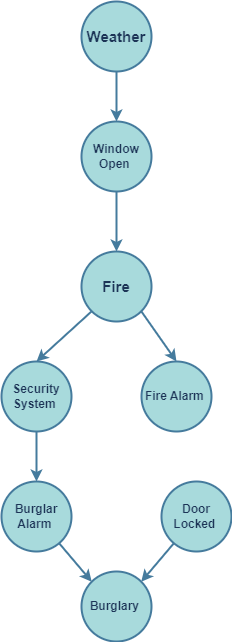

# Smart Home IoT Network Risk Assessment Using Bayesian Networks

This project simulates a Smart Home Internet of Things (IoT) Network to assess risks such as burglary and fire using Bayesian Networks. It evaluates the impact of various parameters like weather, window status, and security system status on these risks.

## Project Overview

The goal of this project is to simulate and analyze the risks associated with smart home IoT networks. By using Bayesian Networks, we can model the dependencies between different factors and assess the likelihood of events such as burglary and fire.

## Features

- **Weather Simulation**: Generates random weather conditions (Rainy or Sunny).
- **Window Status**: Determines if the window is open based on the weather.
- **Door Lock Status**: Simulates whether the door is locked or not.
- **Security System**: Simulates the status of the security system (On or Off).
- **Burglar Alarm**: Triggers based on the security system status.
- **Fire Alarm**: Activates based on the presence of fire.
- **Risk Analysis**: Computes the risk of burglary and fire over multiple simulations.



## How It Works

The simulation uses random probabilities to determine the state of each component in the smart home system. It runs multiple simulations to estimate the risks of burglary and fire, providing valuable insights into the effectiveness of security measures.

## Code Structure

- **Simulation.py**: Contains the code for simulating the smart home environment and analyzing risks.
- **Report.pdf**: A detailed report of the project, including methodology, results, and interpretations.
- **Graph.png**: A visual representation of the Bayesian Network used in the simulation.

## Getting Started

To run the simulation, execute the `Simulation.py` script. The script will perform 10,000 simulations and print the results, including the calculated risks of burglary and fire.

### Prerequisites

- Python 3.x
- Random library (included in Python standard library)

### Running the Simulation

1. Clone the repository:
   ```bash
   git clone https://github.com/Kiana8181/IoT-Home-Risk-Assessment.git

2. Navigate to the project directory:
   ```bash
   cd smart-home-iot-risk-assessment
   
3. Run the simulation script:
   ```bash
   python Simulation.py

## Results

The simulation is designed to run 10,000 iterations to provide a comprehensive assessment of risks associated with a smart home IoT network. The results include:

- **Weather Conditions**: The simulation randomly generates weather conditions, influencing the state of other components like windows and security systems. The results indicate how frequently each weather condition occurs and its impact on overall risk.

- **Window and Door Status**: The simulation evaluates the likelihood of windows being open or doors being unlocked based on weather and security system status. The results show the probability distribution of these states across the iterations.

- **Security and Alarm Systems**: The effectiveness of the security system and its impact on triggering burglar alarms is assessed. The simulation provides statistics on how often the security system is active and how frequently alarms are triggered.

- **Fire and Burglary Risks**: The core of the results is the calculated risk of fire and burglary events. The simulation quantifies these risks by analyzing the interplay between different factors. It presents the probability of fire and burglary incidents occurring in the simulated environment.

- **Overall Insights**: The results offer insights into the effectiveness of different security measures and highlight potential vulnerabilities in the smart home IoT network. This information can guide improvements in security protocols and risk management strategies.

The detailed output includes probabilities and frequencies for each component and event, helping stakeholders understand the dynamics of the smart home environment and make informed decisions.
